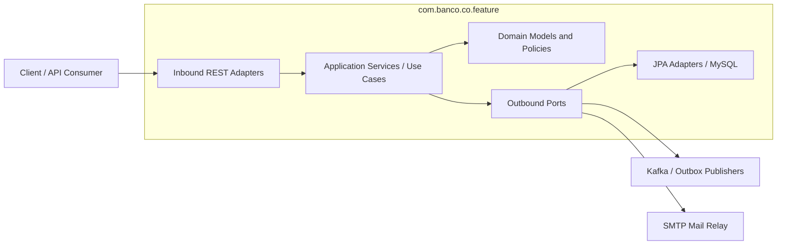
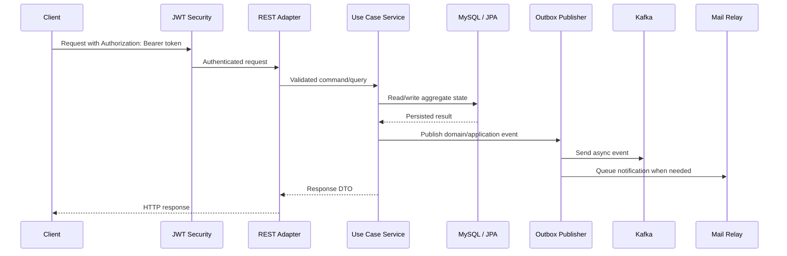

# Banco Service


> Java 24 · Spring Boot 4.0.2 · MySQL · Kafka · Flyway · JWT

Banco Service is a banking backend built with Hexagonal Architecture, DDD, and a feature-first package structure under `com.banco.co.*`. It supports user, account, card, envelope, transaction, authentication, notification, and operational documentation flows.

## Quick Path

1. Install the prerequisites: JDK 24, Docker Desktop or Docker Engine with Compose, and Git.
2. Copy the environment file: `cp .env.example .env` or `Copy-Item .env.example .env`.
3. Start local infrastructure: `docker compose up -d mysql kafka`.
4. Run the application from the repo root:
   - Linux/macOS: `./banco-service/mvnw -f banco-service/pom.xml spring-boot:run`
   - Windows: `banco-service\mvnw.cmd -f banco-service/pom.xml spring-boot:run`
5. Check health: `curl http://localhost:8080/actuator/health`.

Expected response:

```json
{"status":"UP"}
```

## What This Service Provides

| Capability | Description | Useful docs |
|------------|-------------|-------------|
| Authentication and authorization | JWT-based access with role/authority checks | [`auth-flow.md`](docs/diagrams/auth-flow.md), [`adr-0001-security-authorities-scope-convergence.md`](docs/adr-0001-security-authorities-scope-convergence.md) |
| Users | User registration, profile, administration, and persistence adapters | [`docs/snippets/user.md`](docs/snippets/user.md) |
| Accounts | Account lifecycle, balances, and account persistence | [`account-lifecycle.md`](docs/diagrams/account-lifecycle.md), [`docs/snippets/account.md`](docs/snippets/account.md) |
| Cards | Card lifecycle and card operations | [`card-lifecycle.md`](docs/diagrams/card-lifecycle.md), [`docs/snippets/card.md`](docs/snippets/card.md) |
| Envelopes | Envelope workflow and scheduled behavior | [`envelope-workflow.md`](docs/diagrams/envelope-workflow.md), [`docs/snippets/envelope.md`](docs/snippets/envelope.md) |
| Transactions | Transfers, metadata, fraud gates, persistence, and events | [`transaction-transfer-flow.md`](docs/diagrams/transaction-transfer-flow.md), [`docs/snippets/transaction.md`](docs/snippets/transaction.md) |
| Notifications | Email notification flow through an outbox-style relay | [`email-notification-system.md`](docs/email-notification-system.md), [`OUTBOX.md`](docs/OUTBOX.md) |

## Architecture at a Glance

The project uses Hexagonal Architecture so domain behavior stays independent from HTTP, persistence, messaging, and framework details.



| Layer | Main packages | Responsibility |
|-------|---------------|----------------|
| Domain | `domain/model`, `domain/port`, `enums`, `exception` | Business rules, invariants, ports, domain exceptions |
| Application | `service`, `dto`, `mapper` | Use-case orchestration, DTOs, mapping |
| Infrastructure | `adapter/out`, `repository`, `config` | JPA, Kafka, mail, security, framework integration |
| Presentation | `adapter/in/rest`, `controller`, `handler` | REST endpoints, validation, HTTP concerns |

Contributor rules and review standards live in [`CONTRIBUTING.md`](CONTRIBUTING.md).

## Main Runtime Flow



For deeper flow diagrams, see [Visual Guides](#visual-guides).

## Repository Structure

```text
.
├── banco-service/                 # Spring Boot application
│   ├── src/main/java/com/banco/co # Feature-first Java packages
│   ├── src/main/resources         # application.yml and Flyway migrations
│   └── src/test/java/com/banco/co # Unit, slice, and integration tests
├── docs/                          # Architecture, API, diagrams, and operational docs
├── openspec/                      # SDD/OpenSpec planning and archived change artifacts
├── .github/                       # Issue templates and CI workflows
├── docker-compose.yml             # Local MySQL and Kafka
├── CONTRIBUTING.md                # Contributor workflow and review rules
└── README.md                      # Project landing page
```

## Prerequisites

- JDK 24 or newer
- Docker + Docker Compose
- Git
- Maven Wrapper is included in `banco-service/`; a system Maven installation is not required
- Optional: Postman and Python 3 for API documentation verification

## Local Runtime Dependencies

| Dependency | Purpose | Local endpoint | Start command |
|------------|---------|----------------|---------------|
| MySQL 8.0 | Primary database for JPA and Flyway | `localhost:3306` | `docker compose up -d mysql` |
| Kafka 3.7.0 | Event publishing and consumption | `localhost:9092` | `docker compose up -d kafka` |
| SMTP server | Email delivery for notification flows | not bundled | provide your own SMTP server or matching test double |

The Compose file defines MySQL and Kafka only. Email support is configured in the app, but no SMTP container is bundled here.

## Environment Variables

`application.yml` reads configuration from environment variables and the shared `.env` file via `springboot4-dotenv`.

| Variable | Required | Default | Purpose | Safety notes |
|----------|----------|---------|---------|--------------|
| `DB_URL` | Yes | none | JDBC URL for the MySQL database | Do not commit real credentials |
| `DB_USERNAME` | Yes | none | Database username | Keep local-only |
| `DB_PASSWORD` | Yes | none | Database password | Keep local-only |
| `JWT_SECRET_KEY` | Yes | none | Signing key for JWT tokens | Treat as a secret |
| `ISSUER_GENERATOR` | Yes | none | JWT issuer claim | Keep consistent across local clients |
| `JASYPT_ENCRYPTOR_PASSWORD` | Yes | none | Decrypts encrypted properties | Treat as a secret |
| `MAIL_HOST` | Yes | none | SMTP host for email sending | Required for email flows |
| `MAIL_USERNAME` | Yes | none | SMTP username | Required for email flows |
| `MAIL_PASSWORD` | Yes | none | SMTP password | Required for email flows |
| `KAFKA_BOOTSTRAP_SERVERS` | No | `localhost:9092` | Kafka bootstrap server list | Safe to keep at the default for local runs |
| `SPRINGDOTENV_DIRECTORY` | No | `..` | Directory containing `.env` when starting from `banco-service/` | Keep it pointed at the repo root |
| `MAIL_ENABLED` | No | `true` | Enables mail integration | Set to `false` only if you intentionally disable email flows |
| `MAIL_PORT` | No | `587` | SMTP port | Match your SMTP server |
| `MAIL_FROM` | No | `no-reply@banco.co` | Default sender address | Use a non-production value locally |
| `MAIL_RELAY_BATCH_SIZE` | No | `50` | Batch size for mail relay | Tuning knob |
| `MAIL_RELAY_POLL_DELAY_MS` | No | `10000` | Poll interval for mail relay | Tuning knob |
| `MAIL_RELAY_MAX_ATTEMPTS` | No | `5` | Retry budget for mail relay | Tuning knob |
| `MAIL_EXECUTOR_CORE_POOL_SIZE` | No | `2` | Core pool size for mail executor | Tuning knob |
| `MAIL_EXECUTOR_MAX_POOL_SIZE` | No | `8` | Max pool size for mail executor | Tuning knob |
| `MAIL_EXECUTOR_QUEUE_CAPACITY` | No | `500` | Queue capacity for mail executor | Tuning knob |

Compose-only variable:

- `MYSQL_ROOT_PASSWORD` is required by `docker-compose.yml` for the MySQL container.

## Run Locally

Start MySQL and Kafka:

```bash
docker compose up -d mysql kafka
docker compose ps
docker compose logs -f mysql kafka
```

Run the application:

```bash
./banco-service/mvnw -f banco-service/pom.xml spring-boot:run
```

Windows PowerShell or CMD:

```bat
banco-service\mvnw.cmd -f banco-service/pom.xml spring-boot:run
```

Reset local data:

```bash
docker compose down -v
```

## Database and Migrations

- MySQL is the primary database.
- Flyway owns schema migrations.
- `spring.jpa.hibernate.ddl-auto=validate` is enabled, so the schema must match migrations before startup succeeds.
- Keep schema changes in `banco-service/src/main/resources/db/migration`.

## Messaging and Notifications

- Kafka defaults to `localhost:9092` for local development.
- Transaction and notification flows use asynchronous event publishing.
- Email delivery is configured by environment variables, but local Compose does not include an SMTP container.
- The notification architecture is documented in [`docs/email-notification-system.md`](docs/email-notification-system.md) and [`docs/OUTBOX.md`](docs/OUTBOX.md).

## Security Model

- Clients authenticate with `Authorization: Bearer <token>`.
- Role and authority checks are enforced with Spring Security and endpoint annotations.
- JWT, Jasypt, database, and SMTP secrets must come from local environment configuration.
- Do not commit secrets, tokens, encrypted production values, or personal data.
- Security naming decisions are documented in [`docs/adr-0001-security-authorities-scope-convergence.md`](docs/adr-0001-security-authorities-scope-convergence.md).

## API Documentation

| Document | Purpose |
|----------|---------|
| [`docs/api/openapi.yaml`](docs/api/openapi.yaml) | OpenAPI specification for the REST API |
| [`docs/postman/banco-service.postman_collection.json`](docs/postman/banco-service.postman_collection.json) | Postman collection for the full API |
| [`docs/postman/environments/Local.postman_environment.json`](docs/postman/environments/Local.postman_environment.json) | Local Postman environment values |
| [`docs/api/coverage-report.md`](docs/api/coverage-report.md) | OpenAPI/Postman coverage summary |

API documentation drift can be checked with:

```bash
python -m unittest docs/verification/test_api_docs_consistency.py -v
```

This check may report known OpenAPI/Postman drift until API documentation parity work is completed.

## Visual Guides

| Diagram | What it explains |
|---------|------------------|
| [`docs/diagrams/auth-flow.md`](docs/diagrams/auth-flow.md) | Missing, invalid, unauthorized, and authorized JWT request paths |
| [`docs/diagrams/account-lifecycle.md`](docs/diagrams/account-lifecycle.md) | Account state and lifecycle behavior |
| [`docs/diagrams/card-lifecycle.md`](docs/diagrams/card-lifecycle.md) | Card lifecycle behavior |
| [`docs/diagrams/envelope-workflow.md`](docs/diagrams/envelope-workflow.md) | Envelope workflow and scheduled operations |
| [`docs/diagrams/transaction-transfer-flow.md`](docs/diagrams/transaction-transfer-flow.md) | Transfer request, balance validation, persistence, and async publishing |

## Tests and Verification

Run application tests:

```bash
./banco-service/mvnw -f banco-service/pom.xml test
./banco-service/mvnw -f banco-service/pom.xml verify
```

Windows:

```bat
banco-service\mvnw.cmd -f banco-service/pom.xml test
banco-service\mvnw.cmd -f banco-service/pom.xml verify
```

Markdown sanity check:

```bash
git diff --check -- README.md CONTRIBUTING.md
```

Testing expectations are described in [`CONTRIBUTING.md`](CONTRIBUTING.md#testing-expectations).

## Development Workflow

- Keep changes small and reviewable.
- Use Conventional Commits, for example `docs(readme): improve project overview`.
- For substantial features or refactors expected to take more than two hours, use SDD: `/sdd-new feature-name`.
- Open PRs against `master` and link an approved issue.
- Follow the contributor workflow in [`CONTRIBUTING.md`](CONTRIBUTING.md).

## Troubleshooting

| Symptom | Likely cause | What to check |
|---------|--------------|---------------|
| `/actuator/health` is not `UP` | App is not running or dependencies are unavailable | Check app logs and `docker compose ps` |
| MySQL container exits | Missing `MYSQL_ROOT_PASSWORD` | Verify `.env` contains Compose variables |
| App fails during startup schema validation | Flyway migrations and database schema differ | Run migrations or reset local data with `docker compose down -v` |
| Kafka connection fails | Kafka container is not ready or port is unavailable | Check `docker compose logs -f kafka` |
| Mail flows fail locally | SMTP is not bundled in Compose | Configure SMTP variables or disable mail intentionally with `MAIL_ENABLED=false` |
| API docs check fails | Known OpenAPI/Postman drift or contract change | Review [`docs/api/coverage-report.md`](docs/api/coverage-report.md) |

## Documentation Links

| Document | Purpose |
|----------|---------|
| [`CONTRIBUTING.md`](CONTRIBUTING.md) | Contributor setup, architecture rules, PR workflow, and review checklist |
| [`docs/OUTBOX.md`](docs/OUTBOX.md) | Transactional Outbox architecture |
| [`docs/email-notification-system.md`](docs/email-notification-system.md) | Email outbox and notification flow |
| [`docs/README-antifraud-risk-profile-gate.md`](docs/README-antifraud-risk-profile-gate.md) | Antifraud risk profile gate architecture |
| [`docs/adr-0001-security-authorities-scope-convergence.md`](docs/adr-0001-security-authorities-scope-convergence.md) | Security naming ADR |
| [`docs/diagrams/`](docs/diagrams/) | Architecture and flow diagrams |
| [`openspec/`](openspec/) | SDD/OpenSpec change planning and archived implementation records |

## Local Readiness Checklist

- [ ] `.env.example` was copied to `.env`.
- [ ] MySQL and Kafka are running locally.
- [ ] The app starts successfully on port `8080`.
- [ ] `/actuator/health` returns `UP`.
- [ ] Relevant tests pass.
- [ ] API documentation drift was reviewed when API contracts changed.
- [ ] Markdown formatting checks pass.
