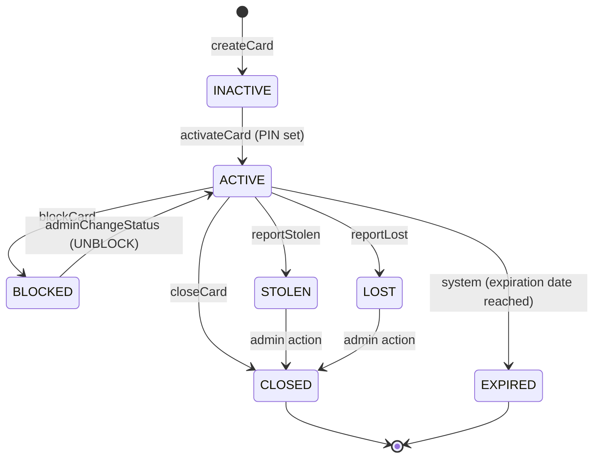

# Card Lifecycle

```mermaid
stateDiagram-v2
    [*] --> INACTIVE : createCard

    INACTIVE --> ACTIVE : activateCard (PIN set)

    ACTIVE --> BLOCKED : blockCard
    BLOCKED --> ACTIVE : adminChangeStatus (UNBLOCK)

    ACTIVE --> STOLEN : reportStolen
    ACTIVE --> LOST : reportLost

    ACTIVE --> CLOSED : closeCard
    STOLEN --> CLOSED : admin action
    LOST --> CLOSED : admin action

    ACTIVE --> EXPIRED : system (expiration date reached)

    CLOSED --> [*]
    EXPIRED --> [*]
```
