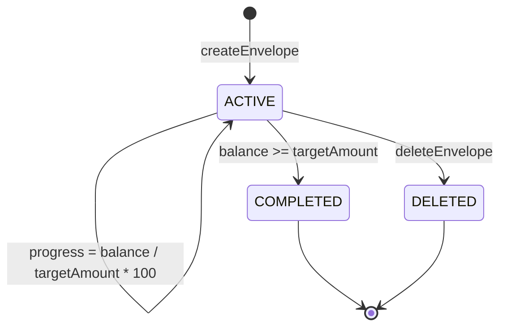

# Envelope Workflow

```mermaid
stateDiagram-v2
    [*] --> ACTIVE : createEnvelope

    ACTIVE --> ACTIVE : deposit (balance increases)
    ACTIVE --> ACTIVE : withdraw (balance decreases)
    ACTIVE --> ACTIVE : progress = balance / targetAmount * 100

    ACTIVE --> COMPLETED : balance >= targetAmount
    ACTIVE --> DELETED : deleteEnvelope

    COMPLETED --> [*]
    DELETED --> [*]
```
