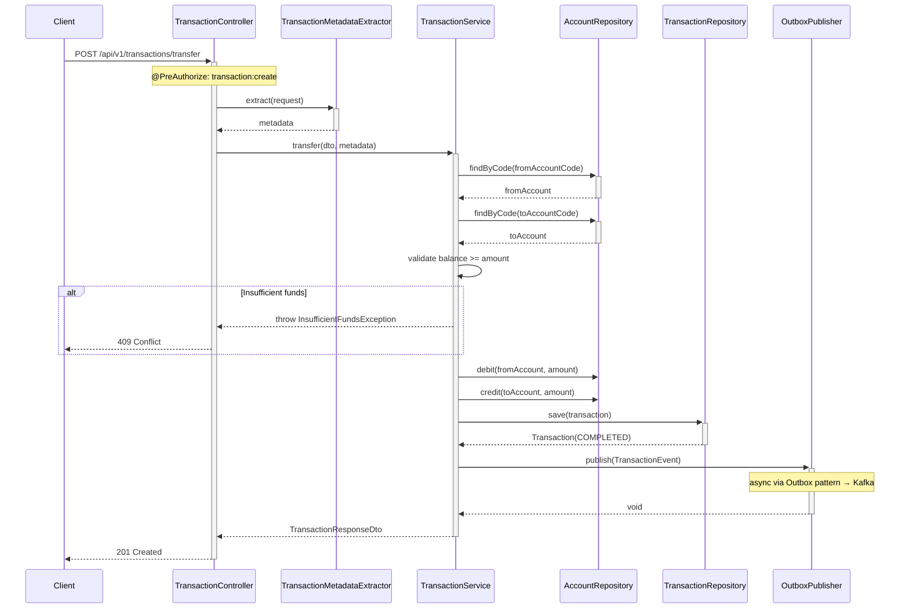

# Transaction Transfer Flow

```mermaid
sequenceDiagram
    participant Client
    participant TC as TransactionController
    participant TME as TransactionMetadataExtractor
    participant TS as TransactionService
    participant AR as AccountRepository
    participant TR as TransactionRepository
    participant OP as OutboxPublisher

    Client->>+TC: POST /api/v1/transactions/transfer
    Note over TC: @PreAuthorize: transaction:create
    TC->>+TME: extract(request)
    TME-->>-TC: metadata
    TC->>+TS: transfer(dto, metadata)

    TS->>+AR: findByCode(fromAccountCode)
    AR-->>-TS: fromAccount

    TS->>+AR: findByCode(toAccountCode)
    AR-->>-TS: toAccount

    TS->>TS: validate balance >= amount

    alt Insufficient funds
        TS-->>TC: throw InsufficientFundsException
        TC-->>Client: 409 Conflict
    end

    TS->>AR: debit(fromAccount, amount)
    TS->>AR: credit(toAccount, amount)

    TS->>+TR: save(transaction)
    TR-->>-TS: Transaction(COMPLETED)

    TS->>+OP: publish(TransactionEvent)
    Note over OP: async via Outbox pattern → Kafka
    OP-->>-TS: void

    TS-->>-TC: TransactionResponseDto
    TC-->>-Client: 201 Created
```
